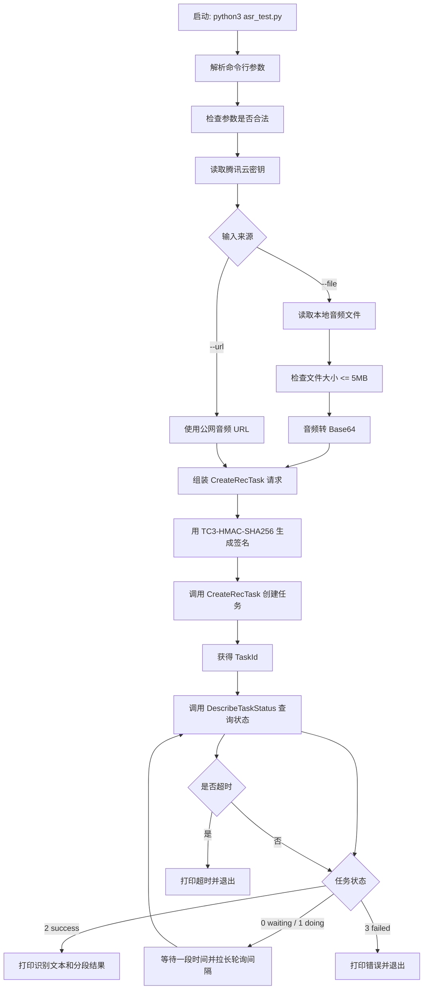

# 腾讯云 ASR 识别流程图

```mermaid
flowchart TD
    A[启动: python3 asr_test.py] --> B[解析命令行参数]
    B --> C[检查参数是否合法]
    C --> D[读取腾讯云密钥]
    D --> E{输入来源}
    E -->|--file| F[读取本地音频文件]
    F --> G[检查文件大小 <= 5MB]
    G --> H[音频转 Base64]
    E -->|--url| I[使用公网音频 URL]
    H --> J[组装 CreateRecTask 请求]
    I --> J
    J --> K[用 TC3-HMAC-SHA256 生成签名]
    K --> L[调用 CreateRecTask 创建任务]
    L --> M[获得 TaskId]
    M --> N[调用 DescribeTaskStatus 查询状态]
    N --> O{任务状态}
    O -->|0 waiting / 1 doing| P[等待一段时间并拉长轮询间隔]
    P --> N
    O -->|2 success| Q[打印识别文本和分段结果]
    O -->|3 failed| R[打印错误并退出]
    N --> S{是否超时}
    S -->|是| T[打印超时并退出]
    S -->|否| O
```

## 运行注意

- 本地文件模式会把音频读成 bytes，再转成 Base64，放到腾讯云 `Data` 字段里。
- URL 模式只发送公网音频地址，音频由腾讯云服务器自己下载。
- 板子时间必须正确，因为 HTTPS 证书校验和腾讯云签名都依赖系统时间。
